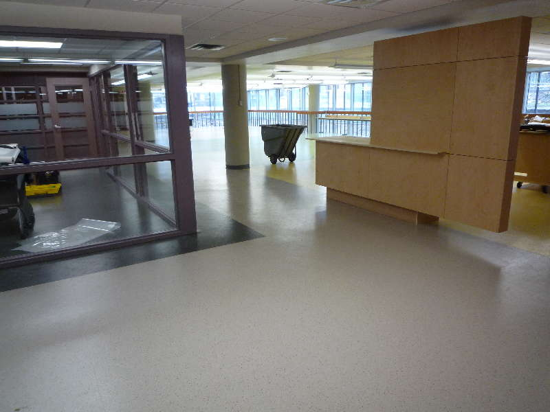
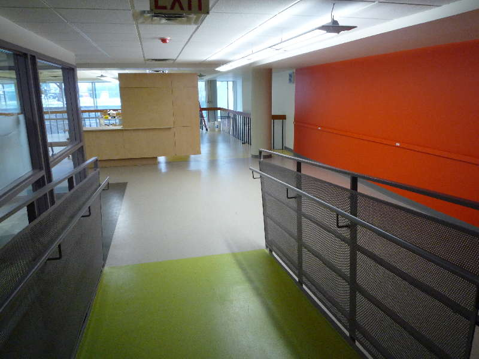
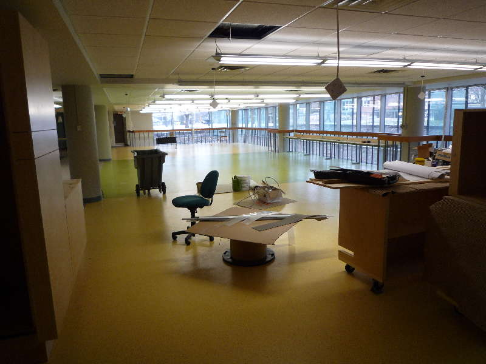
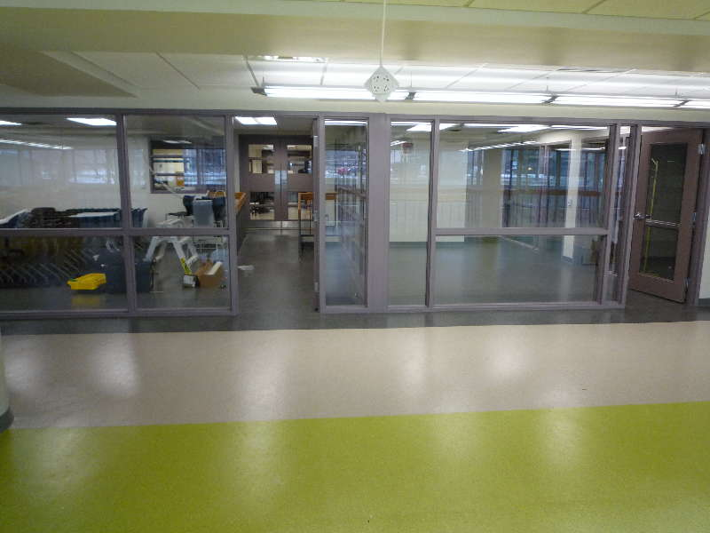
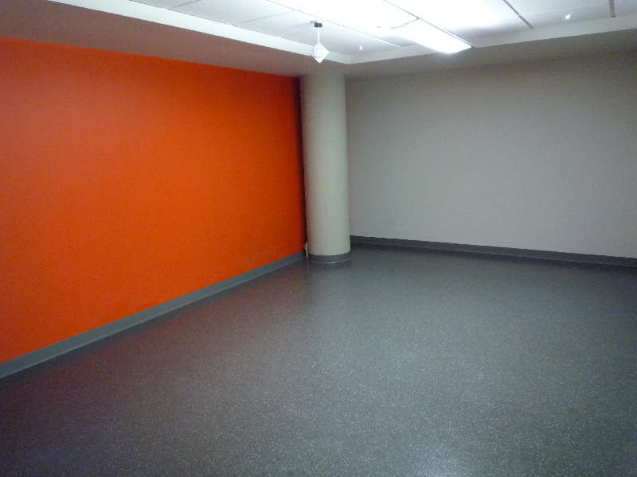
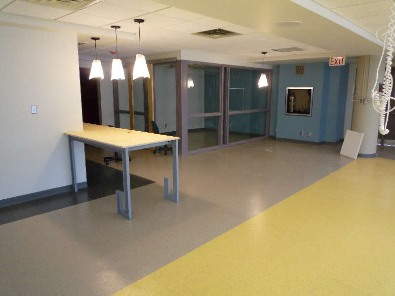

!SLIDE bullets incremental
# SCDS origins #

* Gift from the Lewis and Ruth Sherman Foundation
* positioned for faculty collaboration
* Intended to be cross-disciplinary

.notes Library ideal for this, as we're #altac enough to have the collaborative
mindset but "academic" enough to, well, be academic. Libraries perhaps unique
in academy on this angle.

!SLIDE bullets incremental
# Current state of SCDS #

* Open end of March
* Still creating policy and SLA level docs
* ... but we have projects already running!

.notes do do do! and then create a framework! Has definite disadvantages, in that without a proper frame sometimes you can get pushed around.

!SLIDE center

.notes wide shot

!SLIDE center

.notes ...

!SLIDE center

.notes ...

!SLIDE center

.notes ...

!SLIDE center

.notes ...

!SLIDE center

.notes ...

!SLIDE center
# A note of uncertainty ... #

!SLIDE bullets incremental
# Governance (original) #
* two directors -- academic, administrative
* academic director === faculty member
* cult of personality?

.notes Brief rundown of our original sitch. Stefan's genesis, Jeff runs with it, puts up the money, SS gets CRC, big deal, McGill. Again advantage library - we're less likely to scarper.

!SLIDE bullets incremental
# Governance (actual) #
* Administrative head
* Advisory board with faculty members, other parties

.notes Damn faculty, always running off. Faculty *hard* to get as DH does not (yet?) figure into P&T. Again, yay librarians, 'cos we actually want to *do* shit. You know?

!SLIDE bullets incremental
# So who's this for? #
* Faculty
* Grad students
* maaaaaybe undergrads...
* ...*great* undergrads 
* others?

.notes Stress that initial target of grad students paying off 'cos they're hungry. Get grad students, presumably rest will follow. Detail experience talking to Christina Baade's folks, incl. general crappiness of their office. go over Dwayne's project. Note Mac concentration on STEM and how that's good -- focus on undeserved populations!

!SLIDE bullets incremental
# Relationships outside #
* Lots of existing DH/DS centres
* National/regional partners
* Events, events, events.

.notes DH community still small enough to "know" and make an impact at nearly any level. Current cachet of #altac means that the collaborative model that libraries have always done well is getting more credence.

!SLIDE bullets incremental
# What's next? #
* ... opening would be a good start.
* getting the *right* project mix

.notes Working against the tide. One programmer, one sysadmin (gulp), compare to other DH that have jillions of employees. Mention copyright. At this juncture, got to make sure we can *do* projects.

!SLIDE bullets incremental 
# What's after next? #
* Serious research support
* Act as a hub/incubator for library innovation
* Scholarly communication

.notes I got nothin'.

