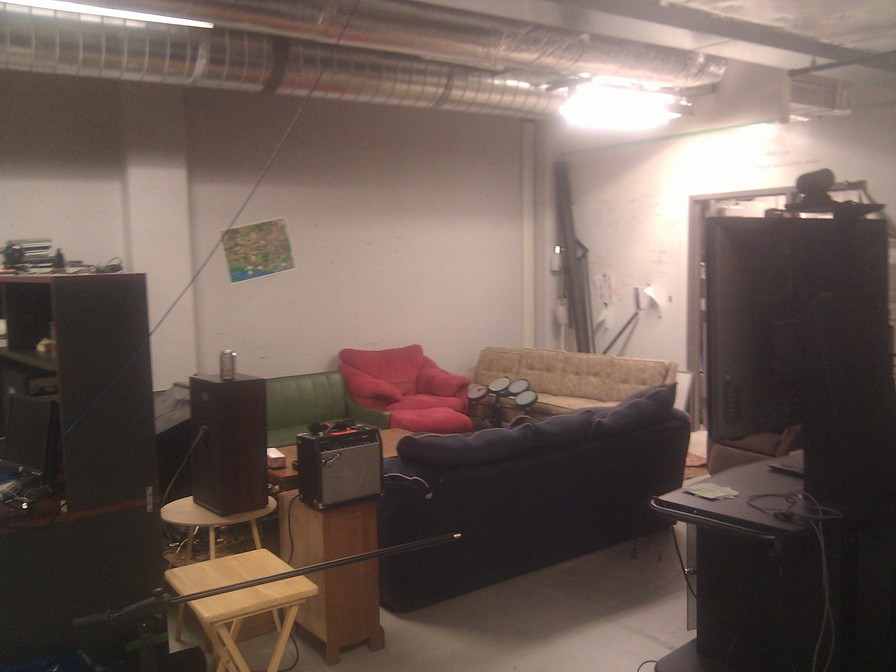
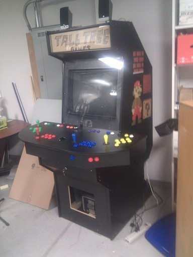
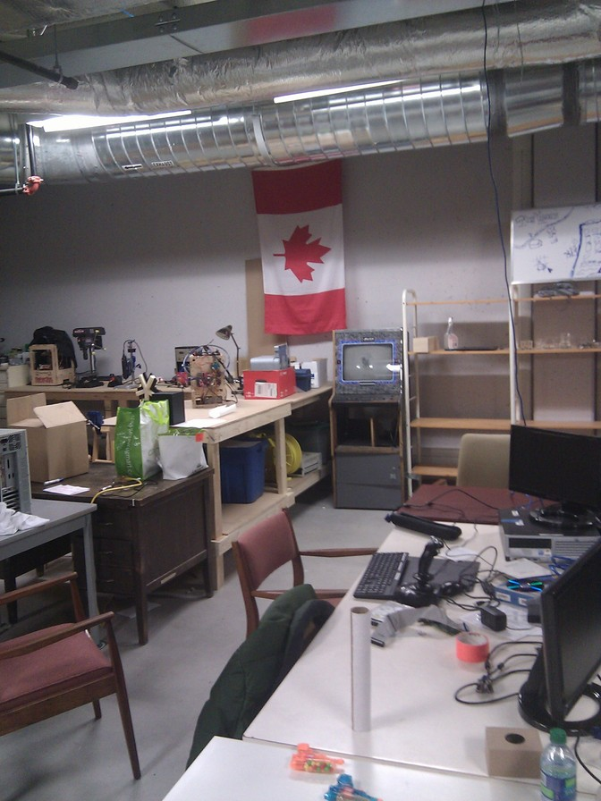
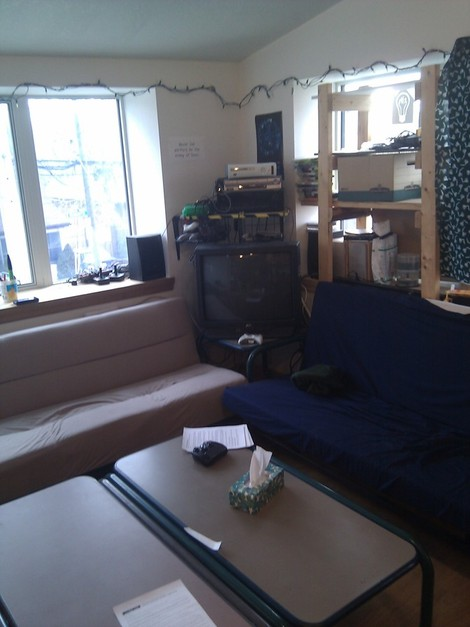
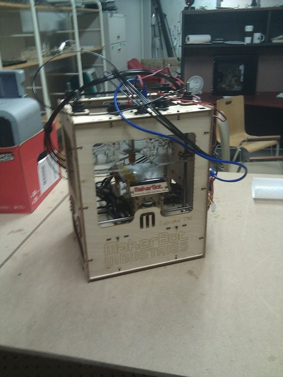

!SLIDE
# why diy? #
.notes talk about your own sort of diy history. grandpa's bathtub gin, pop's blinky box, ee, hijinx. 

!SLIDE
# What is open hardware? #

.notes Ask if anyone recognizes this. Makerbots. Thingiverse. Entire (very profitable) businesses whose entire IP is CC. 

!SLIDE
# What is a hackerspace? #

.notes usually private, usually nonprofit. Think communal garage. Monthly fee, sometimes classes for outside. Note, sadly, often dude-heavy. Talk about thinkhaus a bit.

!SLIDE center

.notes unlab with drumpad.

!SLIDE center

.notes unlab mame cabinet.

!SLIDE center

.notes unlab with canadian flag

!SLIDE center

.notes thinkhaus w/ tv, xbox etc.

!SLIDE center

.notes Makerbot. Ask if anyone has seen one. Try to describe it.
