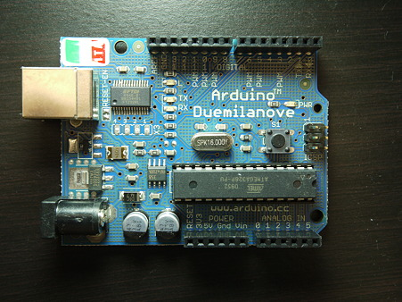

!SLIDE
# why diy? #
.notes talk about your own sort of diy history. grandpa's bathtub gin, pop's blinky box, ee, hijinx. 

!SLIDE
# What is open hardware? #
.notes arduino. Makerbots. Thingiverse. Entire (very profitable) businesses whose entire IP is CC. 

!SLIDE center 

.notes arduino

!SLIDE bullets incremental
# Bullet Points #

* first point
* second point
* third point

